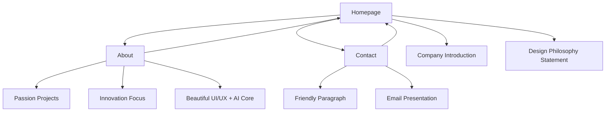

# Superoptimised Website UI/UX Specification

This document defines the visual design specifications and content presentation patterns for Superoptimised's website. It serves as the foundation for frontend development, ensuring a beautiful and cohesive presentation that showcases our design system capabilities.

## Overall UX Goals & Principles

### Content Philosophy

The website exists primarily for legal compliance and professional presence, not lead generation. Content should be authentic, beautiful, and demonstrate our design capabilities through the website itself.

### Design Vision

- **"Wow, this looks beautiful"** - The primary reaction we want from visitors
- **Authentic presentation** - No marketing personas, conversion optimization, or service-selling flows
- **Design system showcase** - The website demonstrates our UI/UX capabilities through its own beauty

### Design Principles

1. **Brutalist precision** - Architectural approach to typography, spacing, and layout with mathematical precision
2. **Beautiful typography** - Perfect font choices, spacing, and hierarchy that creates visual delight
3. **Authentic content** - Real information about who we are, without marketing fluff
4. **Design as demonstration** - The website itself proves our design capabilities
5. **Accessible excellence** - WCAG AA compliance integrated seamlessly into beautiful design

### Change Log

| Date | Version | Description | Author |
|------|---------|-------------|---------|
| 2025-09-17 | 2.0 | Reworked for authentic content and design showcase focus | UX Expert |
| 2025-09-16 | 1.0 | Initial UI/UX specification based on PRD and design system | UX Expert |

## Information Architecture (IA)

### Site Map / Screen Inventory

### Navigation Structure

**Primary Navigation:** Fixed header with beautiful typography displaying "Superoptimised" and three main links: Home, About, Contact. Navigation exemplifies brutalist design with perfect spacing and architectural precision.

**Content Flow:** Simple linear progression through authentic content. No conversion funnels or lead generation patterns. Each page stands alone as beautiful content presentation.

**Page Indication:** Current page shown through subtle typography weight variations, maintaining design system consistency.

## Content Presentation Patterns

### Homepage Experience

**Purpose:** Showcase company identity and design system capabilities through beautiful presentation

**Content Flow:**
1. **Company Introduction:** "Superoptimised" with "We create AI products with beautiful UI/UX"
2. **Design Philosophy:** Brief statement about our approach to creating beautiful, functional interfaces

**Presentation Patterns:**
- Hero typography that demonstrates dramatic scale and perfect spacing
- Clean, architectural layout with purposeful white space
- Typography hierarchy that guides the eye naturally through content

### About Page Experience

**Purpose:** Share authentic information about our passion and focus areas

**Content Sections:**
1. **Passion Projects:** Genuine description of what drives our work
2. **Innovation Focus:** Our commitment to pushing boundaries in AI and design
3. **Beautiful UI/UX + AI Core:** How we combine aesthetic excellence with AI capabilities

**Presentation Patterns:**
- Scannable content structure with beautiful typography
- Visual rhythm created through consistent spacing
- Content that feels personal and authentic, not marketing-driven

### Contact Page Experience

**Purpose:** Provide friendly, accessible contact information

**Content Elements:**
1. **Friendly Paragraph:** Warm, approachable introduction to getting in touch
2. **Email Presentation:** Professional email address presented beautifully

**Presentation Patterns:**
- Welcoming tone without sales pressure
- Email as primary contact method, elegantly displayed
- Simple, clean layout that puts focus on human connection

## Visual Layout Specifications

**Design Implementation:** All layouts implement the brutalist design system directly in code, emphasizing architectural precision and beautiful typography presentation.

### Homepage Layout

**Design Focus:** Showcase our identity and design capabilities through the page itself

**Key Elements:**
- Hero section with "Superoptimised" in dramatic typography
- Subtitle: "We create AI products with beautiful UI/UX"
- Clean navigation header exemplifying brutalist precision
- Perfect spacing that demonstrates our attention to detail

**Visual Notes:** Typography creates immediate impact through scale and contrast. Layout uses mathematical precision in spacing. No conversion elements or calls-to-action.

**Design System Usage:** Hero typography scale, primary color palette, architectural spacing principles

#### About Page Layout

**Design Focus:** Present authentic content about our passion and innovation focus

**Key Elements:**
- Content sections for passion projects, innovation focus, and UI/UX + AI approach
- Typography hierarchy that guides natural reading flow
- Consistent spacing that maintains visual rhythm
- Navigation maintaining design system consistency

**Visual Notes:** Content feels personal and genuine. Typography creates scannable structure without marketing overtones. Focus on beautiful presentation of authentic information.

**Design System Usage:** Display and base typography scales, warm gray for supporting text, consistent spacing grid

#### Contact Page Layout

**Design Focus:** Create welcoming, human connection point

**Key Elements:**
- Friendly introductory paragraph with warm tone
- Email address presented with typographic elegance
- Simple, uncluttered layout focusing on connection
- Consistent branding and navigation

**Visual Notes:** Email presentation uses beautiful typography without sales pressure. Layout prioritizes clarity and approachability.

**Design System Usage:** Display typography for email, base scale for paragraph text, primary color for interactive elements

## Design System Implementation

**System Philosophy:** Brutalist design system with architectural precision, perfect spacing, and beautiful typography. The complete system is documented in `/superoptimizeddesign.md` and serves as both our toolkit and demonstration.

### Typography Excellence

#### Typographic Hierarchy

**Purpose:** Create "wow, this looks beautiful" reactions through perfect typography

**Scale System:**
- mega: `clamp(4rem, 8vw, 7.5rem)` for hero brand name
- hero: `clamp(3rem, 6vw, 5rem)` for page headers
- display: `clamp(1.5rem, 3vw, 2.5rem)` for section headers
- base: `1rem` for body content

**Implementation:** Mathematical precision in spacing, perfect line heights, optimal letter spacing for readability and beauty.

**Usage Philosophy:** Typography as the primary design element. Each size demonstrates architectural thinking and design excellence.

#### Interactive Elements

**Purpose:** Minimal, beautiful interactions that enhance content presentation

**Link Styling:**
- Clean, underlined text links for content navigation
- Subtle hover states that maintain design integrity
- Focus states that prioritize accessibility without breaking aesthetic

**Email Presentation:**
- Typography-focused email display
- Elegant hover effects for interactivity
- Copy-to-clipboard functionality as progressive enhancement

#### Navigation Design

**Purpose:** Architectural navigation that exemplifies design system principles

**Structure:** Fixed header with perfect spacing, beautiful typography hierarchy, and clean page indication

**Behavior:** Subtle current page indication, smooth hover transitions, keyboard navigation support

**Aesthetic:** Demonstrates brutalist principles while maintaining approachable usability

## Visual Identity & Aesthetic

### Brand Expression

**Design Philosophy:** Brutalist aesthetic with architectural precision that showcases our design capabilities. The website itself serves as our portfolio, demonstrating "beautiful UI/UX" through every detail.

**Visual Approach:** Mathematical precision meets artistic sensibility. Every spacing decision, typography choice, and color application demonstrates our commitment to design excellence.

### Color Palette

| Color Type | Hex Code | Usage |
|------------|----------|-------|
| Primary | `#64748b` | Interactive elements, links, focus states |
| Off-Black | `#1a1a1a` | Primary text, dark mode background |
| Off-White | `#fafafa` | Light mode background, dark mode text |
| Warm Gray | `#6b7280` | Secondary text, muted content |
| Light Gray | `#f3f4f6` | Borders, subtle backgrounds |

### Typography

#### Font Families
- **Primary:** Inter (with OpenType features enabled)
- **Display:** Lexend for hero text
- **Monospace:** JetBrains Mono for code elements

#### Type Scale

| Element | Size | Weight | Line Height |
|---------|------|--------|-------------|
| Hero | `clamp(3rem, 6vw, 5rem)` | 700 | 1.1 |
| Display | `clamp(1.5rem, 3vw, 2.5rem)` | 600 | 1.2 |
| H1 | `2.25rem` | 700 | 1.2 |
| H2 | `1.875rem` | 600 | 1.3 |
| Body | `1rem` | 400 | 1.6 |
| Small | `0.875rem` | 400 | 1.5 |

### Iconography

**Icon Library:** Minimal icon usage focusing on semantic HTML and typography. When needed, use simple geometric shapes consistent with brutalist aesthetic.

**Usage Guidelines:** Prefer typography over icons. Use icons only for universally understood actions (email, external links).

### Spacing & Layout

**Grid System:** Responsive grid with max-width of 1200px for main content

**Spacing Scale:**
- xs: `0.5rem` (8px)
- sm: `1rem` (16px)
- md: `2rem` (32px)
- lg: `3rem` (48px)
- xl: `4rem` (64px)
- 2xl: `6rem` (96px)

## Accessibility Requirements

### Compliance Target

**Standard:** WCAG 2.1 AA compliance ensuring accessibility for users with disabilities while maintaining brutalist aesthetic integrity.

### Key Requirements

**Visual:**
- Color contrast ratios: 4.5:1 minimum for normal text, 3:1 for large text
- Focus indicators: 2px ring with primary color and 2px offset
- Text sizing: Support up to 200% zoom without horizontal scrolling

**Interaction:**
- Keyboard navigation: Full site navigable via keyboard with logical tab order
- Screen reader support: Semantic HTML structure with proper ARIA labels where needed
- Touch targets: Minimum 44px × 44px for all interactive elements

**Content:**
- Alternative text: Descriptive alt text for any images used
- Heading structure: Logical heading hierarchy (h1 → h2 → h3)
- Form labels: Explicit labels for email contact functionality

### Testing Strategy

Manual testing with keyboard navigation, screen reader testing with NVDA/VoiceOver, automated accessibility scanning with axe-core, color contrast verification with automated tools.

## Responsiveness Strategy

### Breakpoints

| Breakpoint | Min Width | Max Width | Target Devices |
|------------|-----------|-----------|----------------|
| Mobile | 320px | 767px | Smartphones |
| Tablet | 768px | 1023px | Tablets, large phones |
| Desktop | 1024px | 1439px | Desktop computers |
| Wide | 1440px | - | Large desktop screens |

### Adaptation Patterns

**Layout Changes:** Single column on mobile, multi-column on desktop. Services section stacks vertically on mobile with full-width cards.

**Navigation Changes:** Mobile navigation remains horizontal with smaller typography. Consider hamburger menu only if needed for very small screens.

**Content Priority:** Hero message remains prominent on all devices. Services section maintains equal weight on mobile through vertical stacking.

**Interaction Changes:** Hover states convert to active states on touch devices. Ensure email links work properly on mobile email clients.

## Motion & Interaction

### Animation Philosophy

Subtle, purposeful motion that enhances the beauty of the interface without distraction. Animations serve aesthetic and usability purposes, never marketing goals.

### Interaction Patterns

- **Link Hover:** Elegant underline transitions that feel sophisticated
- **Focus States:** Beautiful focus indicators that maintain design integrity
- **Page Transitions:** Smooth, architectural transitions between content areas
- **Typography Animations:** Subtle letter-spacing or line-height adjustments on hover

## Technical Excellence

### Performance as Design Feature

The website's performance itself demonstrates our technical capabilities and attention to detail.

### Design-First Performance Strategy

Typography-focused design minimizes resource dependencies. Beautiful layouts achieved through CSS architecture rather than heavy assets. Progressive enhancement ensures core beauty is accessible to all users.

## Implementation Roadmap

### Development Priorities

1. Implement brutalist design system with architectural precision
2. Create beautiful typography hierarchy that generates "wow" reactions
3. Build authentic content presentation without conversion patterns
4. Ensure accessibility excellence integrated seamlessly into beautiful design
5. Test across devices with focus on maintaining visual impact

### Design Excellence Checklist

- [x] Authentic content strategy defined (no portfolio, services, conversion optimization)
- [x] Beautiful presentation patterns documented
- [x] Brutalist system with architectural precision specified
- [x] Typography excellence prioritized
- [x] Design-as-demonstration approach established
- [x] Legal compliance focus confirmed

## Specification Summary

This updated UI/UX specification transforms the website from a conversion-focused marketing tool into a beautiful showcase of design capabilities. The specification prioritizes authentic content presentation, architectural design precision, and the "wow, this looks beautiful" reaction over lead generation.

Key transformations:
- Removed all conversion-focused UX patterns and marketing personas
- Replaced service-selling flows with authentic content about passion projects and innovation
- Emphasized brutalist design system as both tool and demonstration
- Made the website itself the primary proof of our UI/UX capabilities
- Established legal compliance and professional presence as primary goals

The specification provides clear guidance for creating a website that serves as a living example of our design philosophy: beautiful UI/UX created with architectural precision and authentic content presentation.